## Abstract

Video is a promising source of knowledge for embodied agents to learn models of the world's dynamics. Large deep networks have become increasingly effective at modeling complex video data in a self-supervised manner, as evaluated by metrics based on human perceptual similarity or pixel-wise comparison. However, it remains unclear whether current metrics are accurate indicators of performance on downstream tasks. We find empirically that for planning robotic manipulation, existing metrics can be unreliable at predicting execution success. To address this, we propose a benchmark for action-conditioned video prediction in the form of a control benchmark that evaluates a given model for simulated robotic manipulation through sampling-based planning. Our benchmark, Video Prediction for Visual Planning ($$VP^2$$), includes simulated environments with $$11$$  task categories and $$310$$ task instance definitions, a full planning implementation, and training datasets containing scripted interaction trajectories for each task category. A central design goal of our benchmark is to expose a simple interface -- a single forward prediction call -- so it is straightforward to evaluate almost any action-conditioned video prediction model. We then leverage our benchmark to study the effects of scaling model size, quantity of training data, and model ensembling by analyzing three highly-performant video prediction models, finding that while scale can improve perceptual quality when modelling visually diverse settings, other attributes such as uncertainty awareness can also aid planning performance. 

## Motivation 

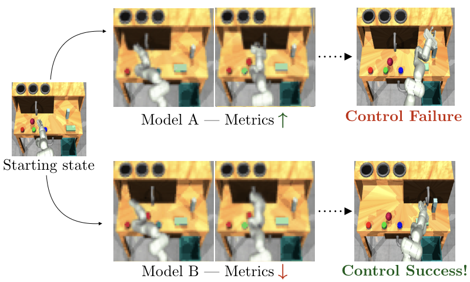{: style="float: right; width: 500px"}
We find that existing perceptual metrics do not always correlate well with downstream manipulation planning performance. 

Therefore, we introduce our *control-centric* benchmark that directly evaluates models on downstream planning performance on manipulation tasks.

## Benchmark Description
Here we show an overview of our benchmark, which includes *environment & task definitions*, *training datasets*, and a full *planning implementation*. The only component that must be provided for evaluation is a video prediction model forward pass.

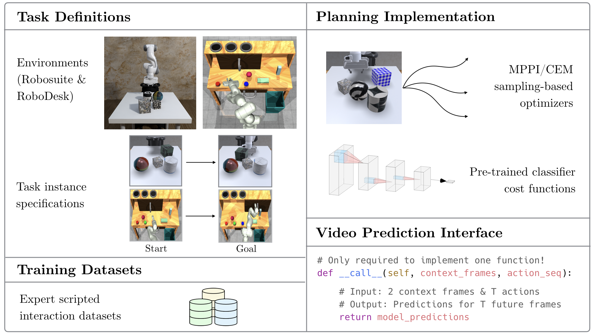

## Benchmark task visualizations
$$VP^2$$ consists of tasks from two environments: a tabletop pushing setting created using ``robosuite`` and the *RoboDesk* manipulation environment. Here we show visualizations of successful completions of example instances of each of the eleven task categories.

### Tabletop tasks built with [``robosuite``](https://robosuite.ai/):

	<figure style="display: inline-block; width: 20%; margin: 10px">
		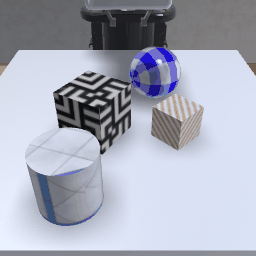
		<figcaption>Push small cube</figcaption>
	</figure>

	<figure style="display: inline-block; width: 20%; margin: 10px">
		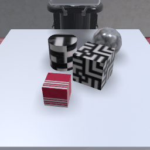
		<figcaption>Push large cube</figcaption>
	</figure>
	<figure style="display: inline-block; width: 20%; margin: 10px">
		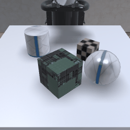
		<figcaption>Push cylinder</figcaption>
	</figure>

	<figure style="display: inline-block; width: 20%; margin: 10px">
		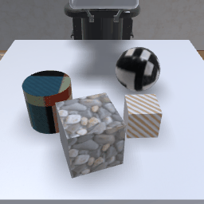
		<figcaption>Push sphere</figcaption>
	</figure>

### [RoboDesk](https://github.com/google-research/robodesk) tasks:

	<figure style="display: inline-block; width: 20%; margin: 10px">
		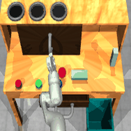
		<figcaption> Push red button </figcaption>
	</figure>

	<figure style="display: inline-block; width: 20%; margin: 10px">
		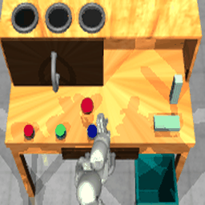
		<figcaption> Push green button </figcaption>
	</figure>
	<figure style="display: inline-block; width: 20%; margin: 10px">
		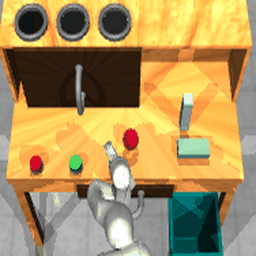
		<figcaption> Push blue button </figcaption>
	</figure>
	<figure style="display: inline-block; width: 20%; margin: 10px">
		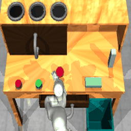
		<figcaption> Open slide</figcaption>
	</figure>

	<figure style="display: inline-block; width: 20%; margin: 10px">
		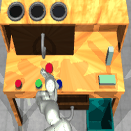
		<figcaption> Open drawer</figcaption>
	</figure>
	<figure style="display: inline-block; width: 20%; margin: 10px">
		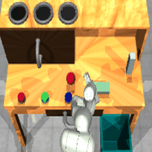
		<figcaption> Upright block off table</figcaption>
	</figure>
	<figure style="display: inline-block; width: 20%; margin: 10px">
		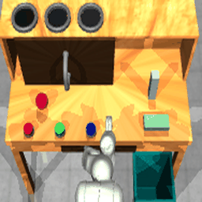
		<figcaption> Flat block off table </figcaption>
	</figure>
	

## Performance of existing models 
We present the current results on the benchmark tasks using three models: SVG' (Villegas et. al, 2019), FitVid (Babaeizadeh et. al, 2021), and Masked Conditional Video Diffusion (MCVD) (Voleti et al., 2022). We results from the four task categories from the ``robosuite`` tabletop environment.

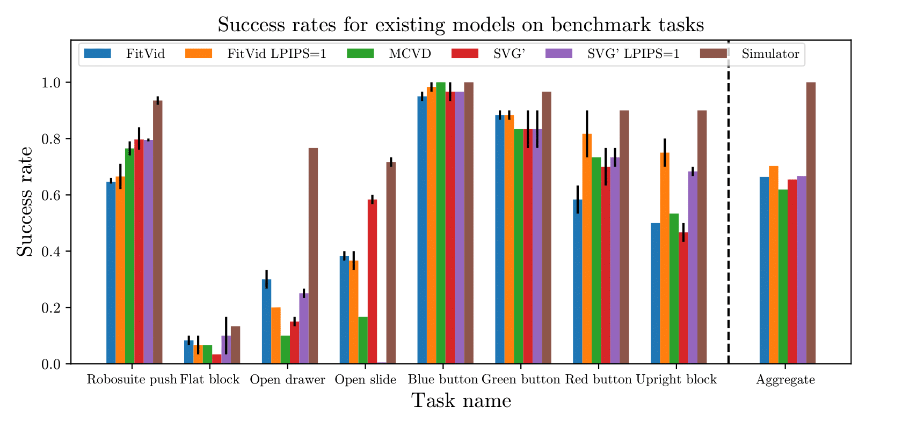

